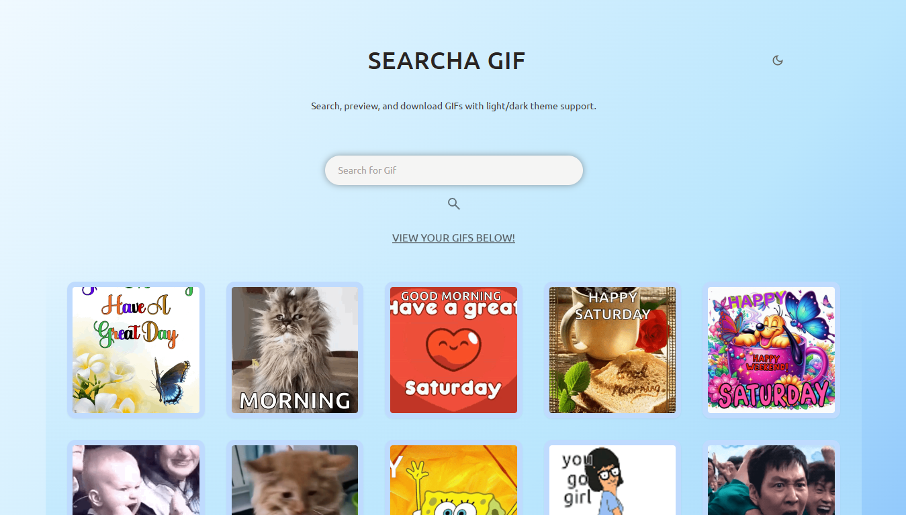
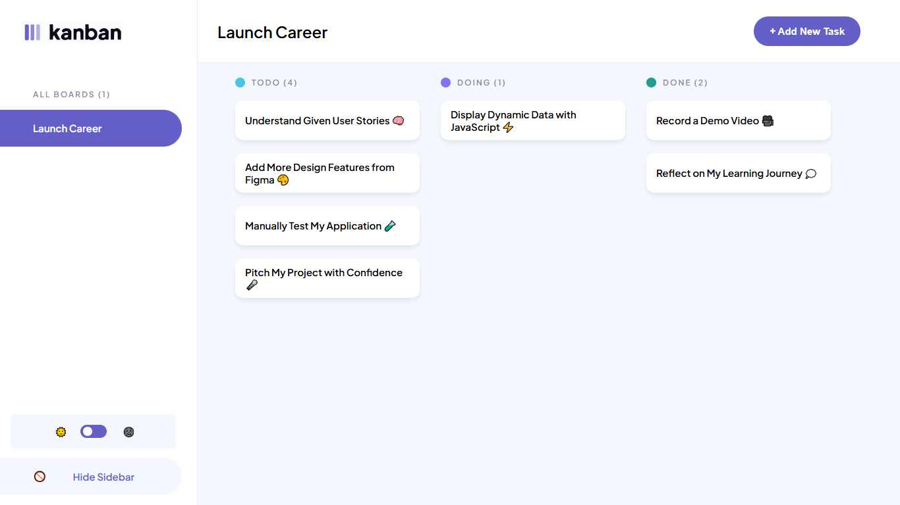

# Tawanda’s Developer Portfolio

**Live site:** https://tawanda-personal-website.netlify.app/

---

## 🎯 Objective

Create a clean, responsive portfolio website to showcase my projects, skills, and contact information. Built for CDV05, it demonstrates design & user experience, project showcase, content quality, and technical proficiency.

---

## 🔑 Key Features

- **Design & UX**

  - Clean, professional layout with consistent typography & color palette
  - Easy navigation via a header with anchor links
  - Responsive design (mobile, tablet, desktop) using Flexbox & CSS Grid
  - Accessibility best practices: semantic HTML, `alt` attributes on images, focus indicators

- **Project Showcase**

  - Two featured projects with descriptions, tech stacks, screenshots, and links
  - Live demos and GitHub repos provided for each project

- **Content Quality**

  - Clear, concise copy with no typos
  - Professional, consistent tone throughout

- **Technical Proficiency**
  - Built with HTML5, CSS3, and vanilla JavaScript (ES6 modules)
  - Clean, well‑organized, and commented code
  - Basic SEO: `<meta>` tags for title, description, viewport, and descriptive URLs
  - Hosted on Netlify for continuous deployment

---

## 🏗️ Built With

- **HTML5**
- **CSS3** (Flexbox, Grid, BEM naming convention)
- **JavaScript** (ES6 Modules)
- **Netlify** for hosting and HTTPS

---

## 🚀 Run Locally

1. **Clone the repo**
   ```bash
   git clone https://github.com/tawandakasunzuma/tawanda-kasunzuma-portfolio.git
   cd tawanda-kasunzuma-portfolio
   ```
2. Open `index.html` in your browser (or use Live Server).

3. (Optional) **View source & comments**
   All HTML, CSS, and JS files include inline comments explaining structure and logic.

## 📂 Projects

### 🎬 Searcha Gif

A sleek and responsive GIF search app with click-to-load more results, dark mode, and one-click downloads for easy sharing.

- **Tech Stack:** React, Tailwind CSS, Giphy API
- **Live Demo:** [searchagif.netlify.app](https://searchagif.netlify.app)
- **Source Code:** [GitHub Repo](https://github.com/tawandakasunzuma/giphy-search-app)
- **Screenshot:**  
  

---

### 📌 Kanban Task Management App

A modern Kanban task manager built with HTML, CSS, and JavaScript, offering dynamic task handling, responsiveness, and theme toggling.

- **Tech Stack:** HTML5, CSS3, JavaScript, LocalStorage
- **Live Demo:** [tawanda-kanban-task-manager.netlify.app](https://tawanda-kanban-task-manager.netlify.app/)
- **Source Code:** [GitHub Repo](https://github.com/tawandakasunzuma/TAWKAS25106_FTO2502_GroupA_Tawanda-Kasunzuma_JSLPP)
- **Screenshot:**  
  

## Contact

- ✉️ tskasunzuma@gmail.com
- 🔗 https://www.linkedin.com/in/tawanda-kasunzuma/
- 🐙 https://github.com/tawandakasunzuma/
